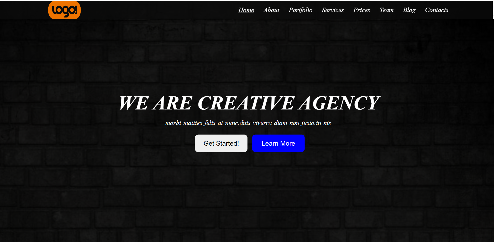
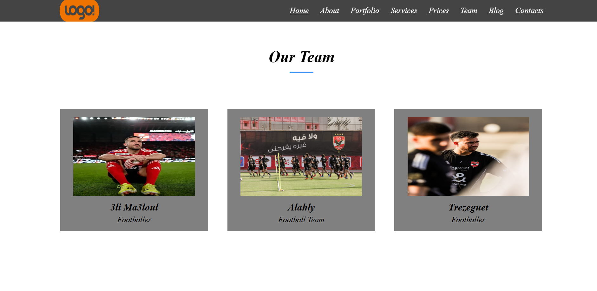
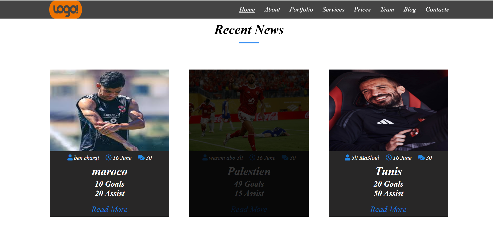

# Simple HTML & CSS Template 🚀

## 📸 Project Gallery

| Home Page | Hover Effect | Full View |
|:---:|:---:|:---:|
|  |  |  |

هذا هو أول مشروع تصميم واجهة مستخدم قمت ببنائه باستخدام تقنيات الويب الأساسية. يركز المشروع على هيكلة العناصر وتنسيقها بشكل جذاب.

## 📋 مميزات المشروع (Features)
- تصميم هادئ ومنظم.
- استخدام الخطوط الخارجية (Google Fonts).
- إضافة تأثيرات حركية بسيطة (Hover Effects).
- استخدام الـ Overlays و الـ Pseudo-elements مثل ::after.

## 🛠 التقنيات المستخدمة (Tech Stack)
* *HTML5:* لبناء هيكل الصفحة.
* *CSS3:* للتنسيق والألوان والتأثيرات.

## 🔗 معاينة المشروع (Live Demo)
يمكنك رؤية التصميم يعمل بشكل مباشر من هنا:
[مشاهدة التصميم](https://mostafagamalelsayed.github.io/Template-1/)

---

### ✍️ ملاحظات تعليمية:
أثناء العمل على هذا المشروع، تعلمت أهمية ترتيب العناصر في الـ HTML وكيفية التعامل مع الـ Position والـ Z-index لعمل الـ Overlay.
